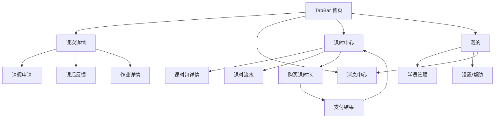

# 家长端小程序 · 页面功能清单

> 版本：v1.0
> 入口：微信小程序「天韵艺术家长端」
> 角色：绑定学员的家长（一个家长账号可绑定多个孩子，支持切换学员）

---

## 一、全局框架

| 项目 | 说明 |
|---|---|
| 底部 TabBar | 首页 · 课表 · 课时 · 我的（4 个一级入口） |
| 顶部导航 | 默认显示「当前学员 + 切换箭头」，进入学员管理 |
| 全局状态 | 登录态、当前学员、消息未读数、课时不足红点 |
| 基础能力 | 微信授权登录、订阅消息、微信支付、分享 |

---

## 二、页面清单总览

| # | 页面 | 路径（建议） | 类型 | 核心功能 |
|---|---|---|---|---|
| 1 | 首页 | pages/index/index | TabBar | 今日提醒、快速入口、公告、品牌展示 |
| 2 | 课程表 | pages/schedule/index | TabBar | 周课表、上课提醒、进入课次详情 |
| 3 | 课时中心 | pages/lessons/index | TabBar | 剩余课时总览、课时包卡片、快捷操作 |
| 4 | 我的 | pages/mine/index | TabBar | 学员切换、消息、设置、帮助 |
| 5 | 课次详情 | pages/session/detail | 二级 | 单次课详情、请假入口、签到状态 |
| 6 | 请假申请 | pages/leave/apply | 二级 | 选课次、填原因、提交、查看审批 |
| 7 | 请假记录 | pages/leave/list | 二级 | 请假历史与审批状态 |
| 8 | 课时包详情 | pages/lessons/package | 二级 | 单个课时包明细、有效期、流水 |
| 9 | 课时流水 | pages/lessons/transactions | 二级 | 消课/充值/赠送/退费流水列表 |
| 10 | 课后反馈 | pages/feedback/list | 二级 | 老师课后反馈列表 |
| 11 | 反馈详情 | pages/feedback/detail | 二级 | 反馈内容、评分、练习建议 |
| 12 | 作业列表 | pages/homework/list | 二级 | 待完成/已完成作业 |
| 13 | 作业详情+打卡 | pages/homework/detail | 二级 | 作业要求、上传打卡、老师点评 |
| 14 | 缴费记录 | pages/order/list | 二级 | 订单列表与状态 |
| 15 | 订单详情/收据 | pages/order/detail | 二级 | 订单信息、电子收据 |
| 16 | 购买课时包 | pages/pay/package | 二级 | 选包、金额、微信支付 |
| 17 | 支付结果 | pages/pay/result | 二级 | 支付成功/失败、跳转课时中心 |
| 18 | 消息中心 | pages/message/index | 二级 | 通知列表（分类/未读） |
| 19 | 消息详情 | pages/message/detail | 二级 | 通知内容 |
| 20 | 学员管理 | pages/mine/children | 二级 | 绑定/切换/解绑学员 |
| 21 | 学员资料 | pages/mine/child-info | 二级 | 学员档案、学习进度 |
| 22 | 设置 | pages/mine/settings | 二级 | 消息开关、隐私、账号 |
| 23 | 帮助/联系校区 | pages/mine/help | 二级 | FAQ、校区联系方式 |
| 24 | 试听预约 | pages/trial/apply | 二级 | 填写试听信息、提交结果 |

---

## 三、核心页面详细说明

### 1. 首页（pages/index/index）
- **顶部**：品牌 Logo + 当前学员姓名/头像 + 消息图标（未读红点）
- **今日提醒卡片**：今日有课（时间/老师/教室）、待办（请假待审批、作业待提交）
- **快捷入口**：请假、购买课时、练琴打卡、联系老师（宫格）
- **公告栏**：校区通知、活动、停课通知
- **课时不足横幅**：剩余课时 ≤ 2 时显示「课时即将用完，点击续费」
- 空状态：未绑定学员 → 引导「添加学员」；无今日课程 → 显示「今天没有课」

### 2. 课程表（pages/schedule/index）
- 周视图：周一~周日横向滚动，今天高亮；每格显示「时间 + 课程 + 老师」
- 切换周：上周/本周/下周；默认定位本周
- 课次状态角标：待上课（蓝）/已确认（绿）/已请假（灰）/已缺勤（红）/已调课（橙）
- 点击课次 → 课次详情
- 顶部汇总：本周共 N 节 / 已上 M 节

### 3. 课时中心（pages/lessons/index）★核心页
- **大数字总览**：剩余总课时（如 32.5 节）+ 本月消课
- **课时包卡片列表**：每个卡片显示 包名 / 总课时 / 剩余 / 有效期倒计时 / 进度条 / 状态（正常·临期·冻结·已用完）
- 操作按钮：续费此包、查看明细
- **下方 Tab**：课时流水 | 缴费记录
- 流水条目：类型图标（消课/充值/赠送/退费/冻结）+ 时间 + 课次名称 + 变化值（+/-）
- 空状态：无课时包 → 引导购买首包

### 4. 课次详情（pages/session/detail）
- 信息区：课程名、老师、时间、教室、状态
- 签到结果：正常/迟到/缺勤/请假（是否扣课时明确展示）
- 操作：请假（开课前 N 小时可操作）、联系老师
- 关联：该课次的课后反馈入口、作业入口

### 5. 请假申请（pages/leave/apply）
- 第一步：选择要请假的课次（默认带出最近一节，可多选，限未开始的课）
- 第二步：选择原因（病假/事假/其他）+ 备注；是否申请补课
- 提交前提示：将展示「请假规则确认」（如提前 4 小时、审批后不扣课时）
- 提交后：状态流转 待审批 → 已通过/已驳回（通过后该课次自动冻结课时，如申请补课则进入补课池）

### 6. 购买课时包（pages/pay/package）
- 课时包列表：名称、节数、赠课、单价、有效期、优惠价
- 选择后展示合计金额、微信支付按钮
- 支付成功 → 支付结果页 → 课时到账（+赠课）→ 课时中心可见
- 支付失败 → 保留订单可重试

### 7. 课后反馈（pages/feedback/list & detail）
- 列表按时间倒序，显示「课程 + 老师 + 评分星 + 摘要」
- 详情：课堂内容、学员表现、老师建议、下次目标；支持点赞/感谢
- 评分维度（老师端填写）：出勤、课堂表现、练习完成度

### 8. 作业与练琴打卡（pages/homework/*）
- 作业卡片：标题、截止日期、状态（待完成/已提交/已点评）
- 详情：作业要求（文字+图片/视频示范）、提交（拍照/视频）、老师点评展示
- 练琴打卡：每日打卡日历、打卡记录、老师点评

### 9. 缴费记录（pages/order/*）
- 订单列表：订单号、课时包、金额、支付状态（待支付/已支付/已退款）
- 详情：商品明细、支付方式、时间、电子收据（可保存图片）
- 退款单展示退款进度

### 10. 我的（pages/mine/index）
- 用户信息：头像、昵称、当前学员
- 学员管理入口（可切换，显示每个学员剩余课时）
- 菜单：消息中心 / 我的反馈 / 我的作业 / 缴费记录 / 设置 / 帮助与联系校区
- 退出登录

---

## 四、消息通知触达（订阅消息）

| 场景 | 通知类型 | 触发时机 |
|---|---|---|
| 上课提醒 | 服务通知 | 课前 24h / 2h / 30min |
| 排课变更 | 服务通知 | 教务改期/调课后 |
| 请假审批结果 | 服务通知 | 审批通过/驳回 |
| 课后反馈已更新 | 服务通知 | 老师提交反馈 |
| 作业布置/点评 | 服务通知 | 布置/点评时 |
| 课时不足 | 服务通知 | 剩余 ≤ 2 节 |
| 课时包到期 | 服务通知 | 到期前 7 天/3 天 |
| 缴费成功/收据 | 服务通知 | 支付成功后 |

---

## 五、页面流转图

---

## 六、非功能要求

- 首屏加载 < 2s，课表周视图流畅滚动
- 所有金额精确到分，课时精确到 0.5 节
- 关键操作（请假、购买）防重复提交
- 微信支付走服务端下单，前端不接触密钥
- 弱网/断网显示重试态，不允许出现「白屏」
