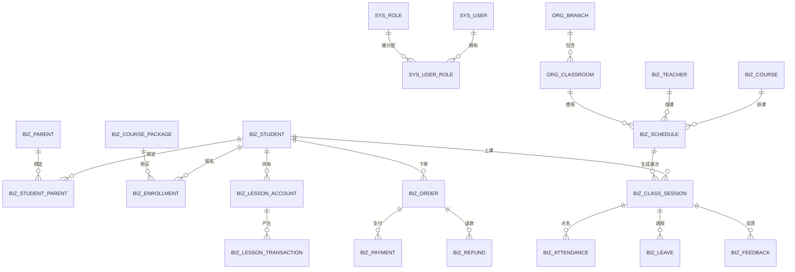

# 数据库表结构设计（MySQL 8.0）

> 版本：v1.0
> 字符集：utf8mb4；引擎：InnoDB；金额统一 decimal(10,2)，课时 decimal(6,1)

---

## 一、ER 关系概览



---

## 二、表清单

| 分组 | 表名 | 说明 |
|---|---|---|
| 系统 | sys_user / sys_role / sys_user_role / sys_config / sys_operation_log | 账号、角色、配置、日志 |
| 组织 | org_branch / org_classroom | 校区、教室 |
| 人员 | biz_student / biz_parent / biz_student_parent / biz_teacher | 学员、家长、教师 |
| 课程 | biz_course / biz_course_package | 课程类型、课时包 |
| 教务 | biz_enrollment / biz_schedule / biz_class_session / biz_attendance / biz_leave | 报名、排课、课次、点名、请假 |
| 课时 | biz_lesson_account / biz_lesson_transaction | 课时账户、流水 |
| 教学 | biz_feedback / biz_homework / biz_practice_check | 反馈、作业、练琴打卡 |
| 财务 | biz_order / biz_payment / biz_refund | 订单、支付、退款 |
| 消息 | sys_message / sys_message_template | 通知与模板 |
| 报表 | biz_report_daily | 每日经营汇总 |

---

## 三、核心表 DDL

### 1. 系统与权限

```sql
CREATE TABLE sys_user (
  id            BIGINT UNSIGNED AUTO_INCREMENT PRIMARY KEY,
  phone         VARCHAR(20)  NOT NULL UNIQUE COMMENT '手机号登录',
  password      VARCHAR(100) NOT NULL COMMENT 'BCrypt',
  name          VARCHAR(50)  NOT NULL,
  avatar_url    VARCHAR(255) DEFAULT NULL,
  user_type     TINYINT      NOT NULL COMMENT '1校长 2教务 3教师 4家长',
  openid        VARCHAR(64)  DEFAULT NULL COMMENT '微信openid',
  status        TINYINT      NOT NULL DEFAULT 1 COMMENT '1启用 0禁用',
  branch_id     BIGINT       DEFAULT NULL COMMENT '所属校区',
  created_at    DATETIME     DEFAULT CURRENT_TIMESTAMP,
  updated_at    DATETIME     DEFAULT CURRENT_TIMESTAMP ON UPDATE CURRENT_TIMESTAMP,
  KEY idx_phone (phone), KEY idx_type (user_type)
) ENGINE=InnoDB DEFAULT CHARSET=utf8mb4 COMMENT='系统用户';

CREATE TABLE sys_role (
  id          BIGINT UNSIGNED AUTO_INCREMENT PRIMARY KEY,
  code        VARCHAR(30) NOT NULL UNIQUE COMMENT 'ROLE_PRINCIPAL/ADMIN/TEACHER/PARENT',
  name        VARCHAR(50) NOT NULL,
  data_scope  TINYINT NOT NULL DEFAULT 3 COMMENT '1全部 2本校区 3本人',
  created_at  DATETIME DEFAULT CURRENT_TIMESTAMP
) ENGINE=InnoDB DEFAULT CHARSET=utf8mb4 COMMENT='角色';

CREATE TABLE sys_user_role (
  id       BIGINT UNSIGNED AUTO_INCREMENT PRIMARY KEY,
  user_id  BIGINT NOT NULL,
  role_id  BIGINT NOT NULL,
  UNIQUE KEY uk_user_role (user_id, role_id)
) ENGINE=InnoDB DEFAULT CHARSET=utf8mb4 COMMENT='用户角色';

CREATE TABLE sys_config (
  id          BIGINT UNSIGNED AUTO_INCREMENT PRIMARY KEY,
  config_key  VARCHAR(50) NOT NULL UNIQUE COMMENT '如 leave_advance_hours',
  config_value VARCHAR(255) NOT NULL,
  description VARCHAR(200),
  updated_at  DATETIME DEFAULT CURRENT_TIMESTAMP ON UPDATE CURRENT_TIMESTAMP
) ENGINE=InnoDB DEFAULT CHARSET=utf8mb4 COMMENT='系统规则参数';

CREATE TABLE sys_operation_log (
  id         BIGINT UNSIGNED AUTO_INCREMENT PRIMARY KEY,
  user_id    BIGINT NOT NULL,
  action     VARCHAR(50) NOT NULL COMMENT 'CONSUME_REVERT/REFUND/ADJUST...',
  target_type VARCHAR(30) COMMENT '表名/对象类型',
  target_id  BIGINT,
  detail     JSON,
  created_at DATETIME DEFAULT CURRENT_TIMESTAMP,
  KEY idx_user (user_id), KEY idx_target (target_type, target_id)
) ENGINE=InnoDB DEFAULT CHARSET=utf8mb4 COMMENT='操作日志';
```

### 2. 组织

```sql
CREATE TABLE org_branch (
  id          BIGINT UNSIGNED AUTO_INCREMENT PRIMARY KEY,
  name        VARCHAR(100) NOT NULL,
  address     VARCHAR(255),
  contact_phone VARCHAR(20),
  status      TINYINT NOT NULL DEFAULT 1
) ENGINE=InnoDB DEFAULT CHARSET=utf8mb4 COMMENT='校区';

CREATE TABLE org_classroom (
  id        BIGINT UNSIGNED AUTO_INCREMENT PRIMARY KEY,
  branch_id BIGINT NOT NULL,
  name      VARCHAR(50) NOT NULL COMMENT '如 钢琴房A',
  capacity  TINYINT DEFAULT 1,
  KEY idx_branch (branch_id)
) ENGINE=InnoDB DEFAULT CHARSET=utf8mb4 COMMENT='教室';
```

### 3. 人员

```sql
CREATE TABLE biz_student (
  id          BIGINT UNSIGNED AUTO_INCREMENT PRIMARY KEY,
  name        VARCHAR(50) NOT NULL,
  gender      TINYINT DEFAULT 0 COMMENT '0未知 1男 2女',
  birth_date  DATE,
  guardian_phone VARCHAR(20),
  level       VARCHAR(50) COMMENT '如 考级/启蒙/进阶',
  status      TINYINT NOT NULL DEFAULT 1 COMMENT '1在读 2停课 3毕业 4退学',
  remark      VARCHAR(500),
  created_at  DATETIME DEFAULT CURRENT_TIMESTAMP
) ENGINE=InnoDB DEFAULT CHARSET=utf8mb4 COMMENT='学员';

CREATE TABLE biz_parent (
  id          BIGINT UNSIGNED AUTO_INCREMENT PRIMARY KEY,
  user_id     BIGINT NOT NULL COMMENT '关联sys_user(家长)',
  name        VARCHAR(50),
  relation    VARCHAR(10) COMMENT '爸爸/妈妈/其他',
  created_at  DATETIME DEFAULT CURRENT_TIMESTAMP
) ENGINE=InnoDB DEFAULT CHARSET=utf8mb4 COMMENT='家长';

CREATE TABLE biz_student_parent (
  id         BIGINT UNSIGNED AUTO_INCREMENT PRIMARY KEY,
  student_id BIGINT NOT NULL,
  parent_id  BIGINT NOT NULL,
  is_main    TINYINT DEFAULT 0 COMMENT '1主要联系人',
  UNIQUE KEY uk_sp (student_id, parent_id)
) ENGINE=InnoDB DEFAULT CHARSET=utf8mb4 COMMENT='学员家长绑定';

CREATE TABLE biz_teacher (
  id           BIGINT UNSIGNED AUTO_INCREMENT PRIMARY KEY,
  user_id      BIGINT NOT NULL COMMENT '关联sys_user(教师)',
  name         VARCHAR(50) NOT NULL,
  title        VARCHAR(50) COMMENT '职称/等级',
  specialize   VARCHAR(100) COMMENT '擅长（考级/启蒙）',
  salary_type  TINYINT NOT NULL DEFAULT 1 COMMENT '1按课时 2按学员比例 3固定',
  salary_rate  DECIMAL(6,3) COMMENT '课时单价或比例',
  status       TINYINT NOT NULL DEFAULT 1,
  created_at   DATETIME DEFAULT CURRENT_TIMESTAMP
) ENGINE=InnoDB DEFAULT CHARSET=utf8mb4 COMMENT='教师';
```

### 4. 课程与课时包

```sql
CREATE TABLE biz_course (
  id           BIGINT UNSIGNED AUTO_INCREMENT PRIMARY KEY,
  name         VARCHAR(100) NOT NULL COMMENT '钢琴一对一/钢琴小组课(1对2)...',
  course_type  TINYINT NOT NULL COMMENT '1一对一 2小组课',
  duration_min SMALLINT NOT NULL DEFAULT 45 COMMENT '单节时长(分钟)',
  consume_coef DECIMAL(4,2) NOT NULL DEFAULT 1.00 COMMENT '消课折算系数',
  price        DECIMAL(10,2) COMMENT '单节标价',
  status       TINYINT NOT NULL DEFAULT 1
) ENGINE=InnoDB DEFAULT CHARSET=utf8mb4 COMMENT='课程类型';

CREATE TABLE biz_course_package (
  id            BIGINT UNSIGNED AUTO_INCREMENT PRIMARY KEY,
  course_id     BIGINT NOT NULL,
  name          VARCHAR(100) NOT NULL COMMENT '如 一对一20节',
  total_lessons DECIMAL(6,1) NOT NULL COMMENT '正课节数',
  gift_lessons  DECIMAL(6,1) NOT NULL DEFAULT 0 COMMENT '赠课节数',
  total_price   DECIMAL(10,2) NOT NULL,
  valid_months  SMALLINT NOT NULL DEFAULT 12 COMMENT '有效期(月)',
  sale_status   TINYINT NOT NULL DEFAULT 1 COMMENT '1在售 0下架',
  start_at      DATE, end_at DATE COMMENT '活动有效期',
  created_at    DATETIME DEFAULT CURRENT_TIMESTAMP
) ENGINE=InnoDB DEFAULT CHARSET=utf8mb4 COMMENT='课时包';
```

### 5. 报名与课时账户（核心）

```sql
CREATE TABLE biz_enrollment (
  id             BIGINT UNSIGNED AUTO_INCREMENT PRIMARY KEY,
  student_id     BIGINT NOT NULL,
  package_id     BIGINT NOT NULL,
  order_id       BIGINT COMMENT '关联购买订单',
  total_lessons  DECIMAL(6,1) NOT NULL COMMENT '到账正课',
  gift_lessons   DECIMAL(6,1) NOT NULL DEFAULT 0,
  paid_amount    DECIMAL(10,2) NOT NULL,
  valid_until    DATE NOT NULL COMMENT '有效期截止',
  status         TINYINT NOT NULL DEFAULT 1 COMMENT '1生效 2冻结 3到期 4已退',
  created_at     DATETIME DEFAULT CURRENT_TIMESTAMP
) ENGINE=InnoDB DEFAULT CHARSET=utf8mb4 COMMENT='报名/课时包生效记录';

CREATE TABLE biz_lesson_account (
  id             BIGINT UNSIGNED AUTO_INCREMENT PRIMARY KEY,
  student_id     BIGINT NOT NULL,
  enrollment_id  BIGINT NOT NULL,
  remain_lessons DECIMAL(6,1) NOT NULL COMMENT '当前剩余',
  frozen_lessons DECIMAL(6,1) NOT NULL DEFAULT 0 COMMENT '冻结课时',
  valid_until    DATE NOT NULL,
  status         TINYINT NOT NULL DEFAULT 1 COMMENT '1正常 2临期 3冻结 4用完 5到期',
  version        INT NOT NULL DEFAULT 0 COMMENT '乐观锁，防并发扣减',
  UNIQUE KEY uk_student_enroll (student_id, enrollment_id)
) ENGINE=InnoDB DEFAULT CHARSET=utf8mb4 COMMENT='课时账户（每课时包一行）';

CREATE TABLE biz_lesson_transaction (
  id             BIGINT UNSIGNED AUTO_INCREMENT PRIMARY KEY,
  account_id     BIGINT NOT NULL,
  student_id     BIGINT NOT NULL,
  session_id     BIGINT COMMENT '关联课次（消课时）',
  trans_type     VARCHAR(20) NOT NULL COMMENT 'RECHARGE/GIFT/CONSUME/FREEZE/UNFREEZE/REFUND/ADJUST/EXPIRE',
  amount         DECIMAL(6,1) NOT NULL COMMENT '正数+ 负数-',
  remain_after   DECIMAL(6,1) NOT NULL COMMENT '变动后余额',
  operator_id    BIGINT COMMENT '操作人',
  remark         VARCHAR(200),
  created_at     DATETIME DEFAULT CURRENT_TIMESTAMP,
  KEY idx_account (account_id), KEY idx_student (student_id), KEY idx_session (session_id)
) ENGINE=InnoDB DEFAULT CHARSET=utf8mb4 COMMENT='课时流水';
```

### 6. 排课与考勤

```sql
CREATE TABLE biz_schedule (
  id           BIGINT UNSIGNED AUTO_INCREMENT PRIMARY KEY,
  branch_id    BIGINT NOT NULL,
  course_id    BIGINT NOT NULL,
  teacher_id   BIGINT NOT NULL,
  classroom_id BIGINT NOT NULL,
  student_ids  JSON COMMENT '小组课学员列表',
  week_day     TINYINT COMMENT '1-7 固定周排课时用',
  start_time   TIME NOT NULL,
  end_time     TIME NOT NULL,
  start_date   DATE, end_date DATE COMMENT '周期起止',
  repeat_type  TINYINT DEFAULT 1 COMMENT '1每周固定 0单次',
  status       TINYINT DEFAULT 1 COMMENT '1启用 0停用',
  created_at   DATETIME DEFAULT CURRENT_TIMESTAMP
) ENGINE=InnoDB DEFAULT CHARSET=utf8mb4 COMMENT='排课模板/单次排课';

CREATE TABLE biz_class_session (
  id          BIGINT UNSIGNED AUTO_INCREMENT PRIMARY KEY,
  schedule_id BIGINT NOT NULL,
  course_id   BIGINT NOT NULL,
  teacher_id  BIGINT NOT NULL,
  classroom_id BIGINT NOT NULL,
  student_id  BIGINT NOT NULL COMMENT '本课次学员（一对一/小组展开）',
  session_date DATE NOT NULL,
  start_time  TIME NOT NULL, end_time TIME NOT NULL,
  status      TINYINT NOT NULL DEFAULT 0 COMMENT '0待上课 1已确认 2已请假 3已缺勤 4已调课 5已取消',
  source      TINYINT DEFAULT 1 COMMENT '1正常 2补课',
  created_at  DATETIME DEFAULT CURRENT_TIMESTAMP,
  UNIQUE KEY uk_schedule_student_date (schedule_id, student_id, session_date),
  KEY idx_date_teacher (session_date, teacher_id)
) ENGINE=InnoDB DEFAULT CHARSET=utf8mb4 COMMENT='课次实例';

CREATE TABLE biz_attendance (
  id          BIGINT UNSIGNED AUTO_INCREMENT PRIMARY KEY,
  session_id  BIGINT NOT NULL UNIQUE,
  student_id  BIGINT NOT NULL,
  teacher_id  BIGINT NOT NULL,
  check_in_status TINYINT NOT NULL DEFAULT 0 COMMENT '0未点名 1正常 2迟到 3早退 4缺席',
  minutes_late SMALLINT DEFAULT 0,
  lesson_deducted DECIMAL(6,1) NOT NULL DEFAULT 0 COMMENT '实际扣课时数',
  transaction_id BIGINT COMMENT '关联消课流水',
  reverted    TINYINT DEFAULT 0 COMMENT '1已撤销',
  checked_at  DATETIME, operator_id BIGINT,
  remark      VARCHAR(200),
  created_at  DATETIME DEFAULT CURRENT_TIMESTAMP
) ENGINE=InnoDB DEFAULT CHARSET=utf8mb4 COMMENT='考勤点名';

CREATE TABLE biz_leave (
  id          BIGINT UNSIGNED AUTO_INCREMENT PRIMARY KEY,
  student_id  BIGINT NOT NULL,
  parent_id   BIGINT NOT NULL,
  session_ids JSON NOT NULL COMMENT '请假课次',
  reason_type TINYINT COMMENT '1病假 2事假 3其他',
  reason      VARCHAR(200),
  want_makeup TINYINT DEFAULT 1 COMMENT '1申请补课',
  status      TINYINT NOT NULL DEFAULT 0 COMMENT '0待审批 1通过 2驳回',
  approve_by  BIGINT, approved_at DATETIME, approve_remark VARCHAR(200),
  created_at  DATETIME DEFAULT CURRENT_TIMESTAMP
) ENGINE=InnoDB DEFAULT CHARSET=utf8mb4 COMMENT='请假申请';
```

### 7. 教学

```sql
CREATE TABLE biz_feedback (
  id          BIGINT UNSIGNED AUTO_INCREMENT PRIMARY KEY,
  session_id  BIGINT NOT NULL,
  student_id  BIGINT NOT NULL,
  teacher_id  BIGINT NOT NULL,
  content     TEXT COMMENT '课堂内容与表现',
  practice_advice TEXT COMMENT '练习建议',
  next_goal   VARCHAR(255),
  rating      TINYINT COMMENT '表现评分1-5',
  created_at  DATETIME DEFAULT CURRENT_TIMESTAMP,
  KEY idx_student (student_id), KEY idx_session (session_id)
) ENGINE=InnoDB DEFAULT CHARSET=utf8mb4 COMMENT='课后反馈';

CREATE TABLE biz_homework (
  id          BIGINT UNSIGNED AUTO_INCREMENT PRIMARY KEY,
  student_id  BIGINT NOT NULL,
  teacher_id  BIGINT NOT NULL,
  session_id  BIGINT,
  title       VARCHAR(100) NOT NULL,
  content     TEXT, media_url JSON COMMENT '示范图片/视频',
  deadline    DATETIME,
  status      TINYINT DEFAULT 0 COMMENT '0待提交 1已提交 2已点评 3已过期',
  created_at  DATETIME DEFAULT CURRENT_TIMESTAMP
) ENGINE=InnoDB DEFAULT CHARSET=utf8mb4 COMMENT='作业';

CREATE TABLE biz_practice_check (
  id          BIGINT UNSIGNED AUTO_INCREMENT PRIMARY KEY,
  student_id  BIGINT NOT NULL,
  homework_id BIGINT,
  media_url   JSON COMMENT '打卡照片/视频',
  duration_min SMALLINT,
  content     VARCHAR(200),
  teacher_comment VARCHAR(200),
  created_at  DATETIME DEFAULT CURRENT_TIMESTAMP,
  KEY idx_student_date (student_id, created_at)
) ENGINE=InnoDB DEFAULT CHARSET=utf8mb4 COMMENT='练琴打卡';
```

### 8. 财务

```sql
CREATE TABLE biz_order (
  id            BIGINT UNSIGNED AUTO_INCREMENT PRIMARY KEY,
  order_no      VARCHAR(32) NOT NULL UNIQUE,
  student_id    BIGINT NOT NULL,
  package_id    BIGINT NOT NULL,
  amount        DECIMAL(10,2) NOT NULL,
  status        TINYINT NOT NULL DEFAULT 0 COMMENT '0待支付 1已支付 2已退款 3已关闭',
  pay_channel   VARCHAR(20) COMMENT 'WECHAT',
  paid_at       DATETIME,
  created_at    DATETIME DEFAULT CURRENT_TIMESTAMP
) ENGINE=InnoDB DEFAULT CHARSET=utf8mb4 COMMENT='订单';

CREATE TABLE biz_payment (
  id             BIGINT UNSIGNED AUTO_INCREMENT PRIMARY KEY,
  order_id       BIGINT NOT NULL,
  transaction_id VARCHAR(64) COMMENT '微信支付单号',
  amount         DECIMAL(10,2) NOT NULL,
  status         TINYINT DEFAULT 0 COMMENT '0进行中 1成功 2失败',
  notify_raw     TEXT, paid_at DATETIME,
  created_at     DATETIME DEFAULT CURRENT_TIMESTAMP
) ENGINE=InnoDB DEFAULT CHARSET=utf8mb4 COMMENT='支付流水';

CREATE TABLE biz_refund (
  id          BIGINT UNSIGNED AUTO_INCREMENT PRIMARY KEY,
  order_id    BIGINT NOT NULL,
  enrollment_id BIGINT,
  amount      DECIMAL(10,2) NOT NULL,
  refund_lessons DECIMAL(6,1) COMMENT '退课时数',
  reason      VARCHAR(200),
  status      TINYINT DEFAULT 0 COMMENT '0待审批 1已审批 2已打款 3驳回',
  apply_by    BIGINT, approve_by BIGINT, paid_at DATETIME,
  created_at  DATETIME DEFAULT CURRENT_TIMESTAMP
) ENGINE=InnoDB DEFAULT CHARSET=utf8mb4 COMMENT='退款单';
```

### 9. 消息与报表

```sql
CREATE TABLE sys_message (
  id          BIGINT UNSIGNED AUTO_INCREMENT PRIMARY KEY,
  user_id     BIGINT NOT NULL,
  msg_type    VARCHAR(30) NOT NULL COMMENT 'SCHEDULE_CHANGE/LEAVE_RESULT/FEEDBACK/HOMEWORK/LESSON_LOW/PAY_SUCCESS...',
  title       VARCHAR(100), content TEXT,
  biz_id      BIGINT COMMENT '关联业务id',
  is_read     TINYINT DEFAULT 0,
  created_at  DATETIME DEFAULT CURRENT_TIMESTAMP,
  KEY idx_user_read (user_id, is_read)
) ENGINE=InnoDB DEFAULT CHARSET=utf8mb4 COMMENT='站内/小程序消息';

CREATE TABLE biz_report_daily (
  id            BIGINT UNSIGNED AUTO_INCREMENT PRIMARY KEY,
  stat_date     DATE NOT NULL,
  branch_id     BIGINT,
  new_students  INT DEFAULT 0,
  scheduled_sessions INT DEFAULT 0,
  attended_sessions  INT DEFAULT 0,
  attendance_rate DECIMAL(5,2),
  consumed_lessons  DECIMAL(10,1) DEFAULT 0,
  revenue        DECIMAL(10,2) DEFAULT 0,
  UNIQUE KEY uk_date_branch (stat_date, branch_id)
) ENGINE=InnoDB DEFAULT CHARSET=utf8mb4 COMMENT='每日经营汇总（定时任务生成）';
```

---

## 四、关键设计要点

1. **防并发重复扣课时**：`biz_lesson_account.version` 乐观锁 + 扣减走 `UPDATE ... SET remain_lessons = remain_lessons - ? , version = version + 1 WHERE id=? AND remain_lessons >= ?`，失败则事务回滚并重试。
2. **可对账**：每个 `biz_lesson_transaction` 记录变动前后余额与操作人；消课流水关联课次与点名，撤销消课 = 新增一条反冲流水。
3. **课次实例化**：排课模板（`biz_schedule`）按日期展开成课次（`biz_class_session`），小组课按学员各生成一行，便于点名与统计。
4. **金额/课时精度**：金额 decimal(10,2)；课时 decimal(6,1)，支持 0.5 节折算。
5. **软删除与审计**：关键表含 status，不做物理删除；敏感操作写 `sys_operation_log`。
6. **报表定时化**：每日凌晨汇总到 `biz_report_daily`，校长看板直接读汇总，避免实时大查询。
