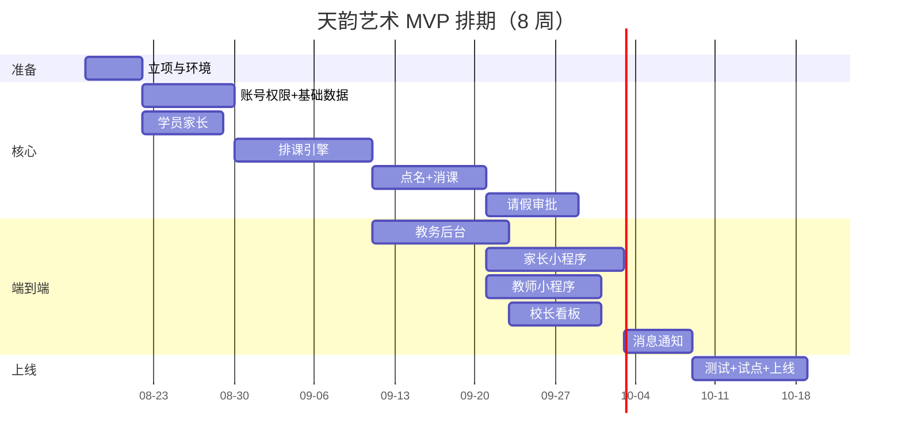

# 天韵艺术管理平台 · 开发排期表

> 版本：v1.0  |  基准：4-5 人开发团队（前端 1-2、后端 1-2、产品/测试 0.5-1）
> 单位：人日（1 人日 = 1 人 1 天）

---

## 一、分期与里程碑

| 阶段 | 周期 | 里程碑 |
|---|---|---|
| M0 立项准备 | 第 1 周 | 需求定稿、原型确认、账号/资质、开发环境 |
| MVP（一期） | 第 2-9 周（8 周） | **核心闭环上线**：排课→点名→消课→请假→课时查询 |
| V1（二期） | 第 10-21 周（12 周） | 品牌官网、在线续费、通知体系、课酬结算 |
| V2（三期） | 第 22-33 周（12 周） | 经营驾驶舱、多校区、考级/比赛专项、数据大屏 |

---

## 二、MVP 任务拆解（详细）

| # | 任务 | 说明与验收 | 人日 | 依赖 | 优先级 |
|---|---|---|---|---|---|
| 1 | 项目初始化 | 前后端脚手架、CI、Docker 环境、代码规范 | 3 | - | P0 |
| 2 | 账号与权限 | 手机号+密码登录、JWT、RBAC（校长/教务/教师/家长） | 6 | 1 | P0 |
| 3 | 基础数据 | 校区/教室/课程类型/课时包 CRUD | 4 | 1 | P0 |
| 4 | 学员与家长 | 学员档案、家长绑定、多学员切换 | 6 | 2 | P0 |
| 5 | 排课引擎 | 周排课模板、按日期生成课次、冲突检测、调课 | 14 | 3,4 | P0 |
| 6 | 考勤点名 | 教师点名、状态(正常/迟到/缺席)、撤销（24h） | 8 | 5 | P0 |
| 7 | **课时账户+消课** | 课时包到账、扣减(系数/顺序)、乐观锁防并发、流水、冻结/解冻 | 16 | 3,4,6 | P0 |
| 8 | 请假审批 | 家长申请、时限校验、教务审批、课时冻结、补课池 | 10 | 5,7 | P0 |
| 9 | 家长小程序 | 登录绑定、课表、课时中心、请假、课次详情 | 18 | 4,5,7,8 | P0 |
| 10 | 教师小程序 | 我的课表、点名、课后反馈、课酬查询 | 14 | 5,6,7 | P0 |
| 11 | 教务后台 | 排课管理页、学员管理页、请假审批页、课时包配置 | 16 | 3,5,8 | P0 |
| 12 | 校长看板 | 今日概况、营收/到课/消课报表、教师排行、流失预警 | 10 | 7,11 | P1 |
| 13 | 消息通知 | 上课提醒、请假结果、课时不足、到期提醒（订阅消息+短信） | 8 | 8,9,10 | P1 |
| 14 | 测试与上线 | 用例、回归、UAT、试点校区数据迁移、上线 | 10 | 全部 | P0 |
| | **MVP 合计** | | **≈ 143 人日** | | |

> 按 4.5 人并行 ≈ 32 人日/周 → **MVP 约 4.5 周排程 + 2 周缓冲/联调 ≈ 8 周**（含周末与评审）。

---

## 三、V1（二期）任务概览

| # | 任务 | 人日 | 说明 |
|---|---|---|---|
| 1 | 品牌官网 | 15 | 品牌展示、师资、试听课预约、线索进入系统 |
| 2 | 在线续费/购买课时包 | 10 | 微信支付、订单、电子收据 |
| 3 | 通知体系完善 | 8 | 公众号模板、短信、小程序订阅消息 |
| 4 | 课酬结算 | 10 | 按课时/比例方案、月度结算单 |
| 5 | 作业与练琴打卡 | 10 | 布置、提交、点评、打卡日历 |
| 6 | 家长满意度评价 | 4 | 课后评分、汇总 |
| 7 | 反馈体验优化 | 6 | 家长端/教师端迭代 |
| | **V1 合计** | **≈ 63 人日** | 约 12 周（含联调测试） |

## 四、V2（三期）任务概览

| # | 任务 | 人日 | 说明 |
|---|---|---|---|
| 1 | 经营驾驶舱升级 | 12 | 续费预测、流失模型、对比分析 |
| 2 | 多校区/多门店 | 10 | 数据隔离、跨校区报表 |
| 3 | 考级/比赛/音乐会专项 | 8 | 报名、进度、成绩 |
| 4 | 数据大屏 | 6 | 前台/校长室展示 |
| 5 | 系统开放能力 | 10 | 导出、API、埋点 |
| | **V2 合计** | **≈ 46 人日** | 约 12 周（含打磨） |

---

## 五、MVP 甘特图（示意）

---

## 六、团队配置建议

| 角色 | 人数 | 职责 |
|---|---|---|
| 产品经理/项目经理 | 0.5 | 需求、原型验收、排期、对需求 |
| 后端工程师 | 1-2 | 业务 API、课时引擎、支付、报表 |
| 前端工程师（Web） | 1 | 教务后台、校长看板、品牌官网 |
| 前端工程师（小程序） | 1 | 家长端、教师端小程序（uni-app 复用） |
| 测试/运维 | 0.5-1 | 用例、回归、部署、数据迁移 |

## 七、关键风险与对策

| 风险 | 对策 |
|---|---|
| 课时/消课规则有争议 | 上线前校长拍板规则，系统参数化+试点期可人工修正 |
| 排课引擎复杂度超预期 | 先做单校区+固定周排课，再扩展冲突检测与批量调课 |
| 微信小程序资质审核 | 提前准备营业执照与教育类目资质，预留 2-3 周 |
| 历史课时数据迁移 | 试点期由教务手工录入/批量导入，先保证新数据正确 |
| 团队并行协调成本 | 每周迭代评审，接口文档先行（OpenAPI） |

---

## 八、上线节奏建议

1. **第 6 周**：内部灰度（员工+真实数据小范围试运行）
2. **第 7-8 周**：1 个校区全量切换，双轨记录（系统+纸质）
3. **第 9 周**：正式上线，停用双轨，进入 V1 规划
